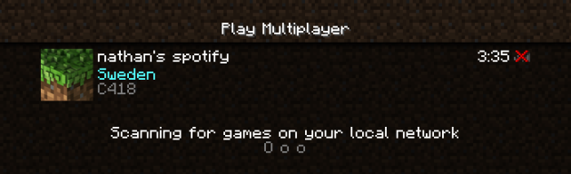
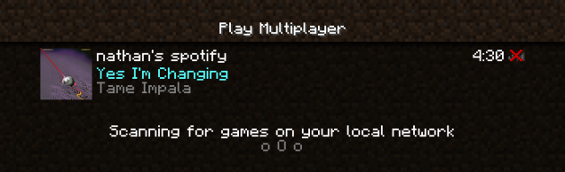
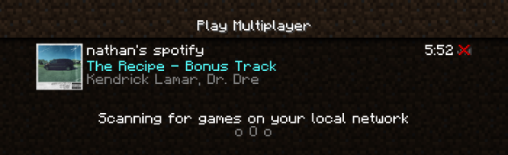

## spotify-motd

a fake minecraft server that shows my current spotify song as the motd (message of the day)

## how it works

this server listens for my spotify activity changes through server sent events from https://github.com/nathanielfernandes/watcher

it then uses https://github.com/nathanielfernandes/motd to handle the tcp connection and send the motd to the client

## ip

`mc.ncp.nathanferns.xyz`
